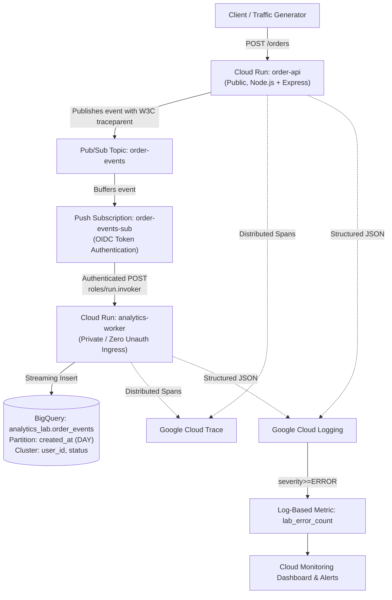

# GCP BigQuery, Cloud Run, Pub/Sub & Observability Lab

An enterprise-grade, hands-on interview learning lab deployed on Google Cloud Platform, demonstrating serverless microservices, asynchronous message decoupling, authenticated OIDC push patterns, partitioned/clustered analytical data warehousing with BigQuery, and end-to-end distributed observability using OpenTelemetry, Google Cloud Trace, Cloud Logging, and Cloud Monitoring.

---

## Architecture Overview



---

## Active Lab Environment Details

- **GCP Project ID**: `bq-observe-lab-840614`
- **Region**: `europe-west1`
- **BigQuery Location**: `europe-west1`
- **Order API URL**: `https://order-api-769996365752.europe-west1.run.app`
- **Analytics Worker URL**: `https://analytics-worker-769996365752.europe-west1.run.app` (Private)
- **Pub/Sub Topic**: `projects/bq-observe-lab-840614/topics/order-events`
- **Pub/Sub Push Subscription**: `projects/bq-observe-lab-840614/subscriptions/order-events-sub`
- **BigQuery Table**: `bq-observe-lab-840614.analytics_lab.order_events`
- **Monitoring Dashboard**: `projects/769996365752/dashboards/1d2333c3-7a51-48cc-b628-167a9bfe691d`

---

## Repository Structure

```
gcp-bigquery-observability-lab/
├── services/
│   ├── order-api/               # Express API + OpenTelemetry + Pub/Sub publisher
│   │   ├── src/                 # TypeScript source (index.ts, tracer.ts)
│   │   ├── package.json
│   │   ├── tsconfig.json
│   │   └── Dockerfile
│   └── analytics-worker/        # Private push consumer + BigQuery streaming
│       ├── src/                 # TypeScript source (index.ts, tracer.ts)
│       ├── package.json
│       ├── tsconfig.json
│       └── Dockerfile
├── sql/
│   ├── basic.sql                # Count all events
│   ├── aggregation.sql          # Revenue grouped by user
│   ├── time_analytics.sql       # Orders grouped by day
│   ├── filtering.sql            # Filter by specific user
│   ├── partitioning.sql         # Partition-pruned date filter
│   ├── clustering.sql           # Clustered column filter
│   ├── combined.sql             # Partition pruning + cluster block pruning
│   ├── window_function.sql      # DENSE_RANK user revenue ranking
│   ├── duplicates.sql           # Detect duplicates & deduplication pattern
│   ├── jobs.sql                 # INFORMATION_SCHEMA.JOBS query
│   └── metadata.sql             # INFORMATION_SCHEMA.PARTITIONS metadata
├── monitoring/
│   ├── dashboard.json           # 6-widget Cloud Monitoring Dashboard
│   └── alert-policy.json        # Cloud Monitoring Alert Policy on error metric
├── scripts/
│   ├── setup-gcp.sh             # Provision GCP infrastructure & IAM
│   ├── deploy.sh                # Build images & deploy Cloud Run services
│   ├── generate-traffic.sh      # Bash traffic generator (orders, slow, errors)
│   ├── generate-traffic.ps1     # PowerShell traffic generator
│   ├── verify.sh                # Bash automated verification suite
│   ├── verify.ps1               # PowerShell automated verification suite
│   └── cleanup.sh               # Safe resource cleanup script
├── docs/
│   ├── ARCHITECTURE.md          # Complete architecture & telemetry flow
│   ├── COMMANDS-RUN.md          # Audit trail of all 30+ executed commands
│   ├── IAM.md                   # IAM Matrix & OIDC authentication deep-dive
│   ├── BIGQUERY-INTERVIEW-NOTES.md # BigQuery vs Postgres, Partitioning, Slots
│   ├── LOGGING.md               # Structured JSON & Logs Explorer cheatsheet
│   ├── FAILURE-LAB.md           # Controlled retry lab & backlog recovery
│   ├── CONSOLE-CHECKLIST.md     # Step-by-step Cloud Console exploration
│   └── INTERVIEW-CHEATSHEET.md  # 20-40s interview-ready explanations
└── README.md
```

---

## Quick Start & Verification

### 1. Run Automated Verification Suite
Verify all 19 resources, APIs, service accounts, and configurations:
```powershell
powershell -ExecutionPolicy Bypass -File scripts/verify.ps1
```
*(Result: 19 PASSED, 0 FAILED)*

### 2. Generate Traffic
Send 25 orders across 8 users, 3 slow latency requests, and 1 controlled error:
```powershell
powershell -ExecutionPolicy Bypass -File scripts/generate-traffic.ps1
```

### 3. Query BigQuery Data Warehouse
```bash
# Count total events and distinct orders
Get-Content sql/basic.sql | bq query --use_legacy_sql=false

# Inspect daily partition metrics
Get-Content sql/time_analytics.sql | bq query --use_legacy_sql=false

# Inspect query execution metrics (bytes, slot ms, cache)
Get-Content sql/jobs.sql | bq query --use_legacy_sql=false
```

### 4. Inspect Structured Logs
Open [Logs Explorer](https://console.cloud.google.com/logs/query) and filter by any Order ID:
```sql
resource.type="cloud_run_revision"
jsonPayload.orderId="ord-12df23c8"
```

### 5. Inspect Cloud Trace
Open [Trace Explorer](https://console.cloud.google.com/traces/explorer) to inspect the 4-span waterfall:
1. `order-api.process-order`
2. `order-api.pubsub-publish`
3. `analytics-worker.process-order`
4. `analytics-worker.bigquery-insert`

---

## Clean Up

When you are finished exploring the resources in Google Cloud Console:

**Option A (Recommended for disposable projects):**
Delete the entire project immediately to stop all billing:
```bash
gcloud projects delete bq-observe-lab-840614
```

**Option B:**
Run the selective resource cleanup script:
```bash
./scripts/cleanup.sh bq-observe-lab-840614
```
