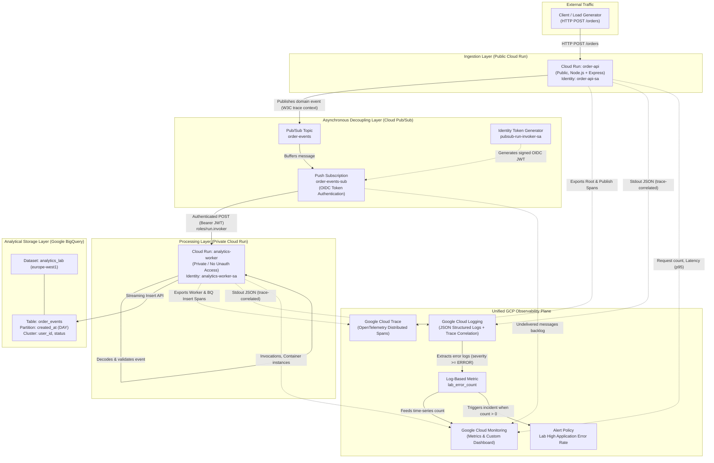
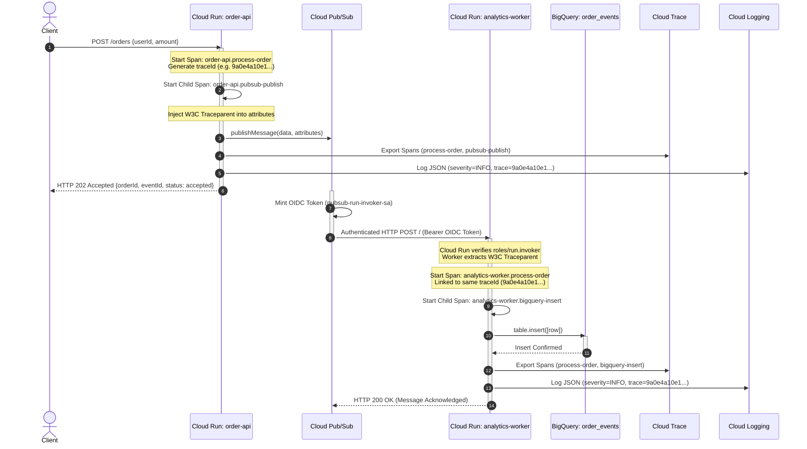

# System Architecture — GCP BigQuery & Observability Lab

## 1. High-Level Architecture Diagram

The lab implements an asynchronous, decoupled event-driven architecture designed for cloud scalability, strict IAM boundary isolation, and end-to-end distributed observability.

---

## 2. Component Breakdown

### A. Client Ingestion: `order-api`
- **Platform**: Cloud Run (Serverless Container).
- **Access Model**: Public (`--allow-unauthenticated`).
- **Identity**: Dedicated Service Account `order-api-sa@bq-observe-lab-840614.iam.gserviceaccount.com`.
- **Responsibilities**:
  1. Validates input schema (`userId`, `amount`).
  2. Generates unique domain identifiers (`orderId`, `eventId`).
  3. Initializes OpenTelemetry span `order-api.process-order` and child span `order-api.pubsub-publish`.
  4. Injects W3C distributed trace context (`traceparent`) into Pub/Sub message attributes.
  5. Publishes message buffer asynchronously to Pub/Sub topic `order-events`.
  6. Emits single-line structured JSON logs with `logging.googleapis.com/trace` correlation.
  7. Returns synchronous `HTTP 202 Accepted` to client immediately without waiting for database writes.

### B. Message Decoupling: Cloud Pub/Sub
- **Topic**: `order-events` receives events published by `order-api`.
- **Subscription**: `order-events-sub` (Push Subscription).
- **Authentication**: OIDC Identity Token minted via `pubsub-run-invoker-sa`.
- **Decoupling Value**: Isolates client-facing operational availability from downstream analytical processing speed or BigQuery ingestion rate spikes.

### C. Analytical Worker: `analytics-worker`
- **Platform**: Cloud Run (Serverless Container).
- **Access Model**: Strictly Private (`--no-allow-unauthenticated`).
- **Identity**: Dedicated Service Account `analytics-worker-sa@bq-observe-lab-840614.iam.gserviceaccount.com`.
- **Responsibilities**:
  1. Receives push messages authenticated with OIDC Bearer tokens.
  2. Extracts incoming W3C trace context from Pub/Sub attributes, continuing the distributed trace seamlessly.
  3. Decodes Base64 message envelope and validates event payload.
  4. Writes rows to BigQuery table `analytics_lab.order_events` via the BigQuery Node.js client SDK.
  5. Emits structured JSON logs containing trace ID, span ID, order ID, and user ID.
  6. Acknowledges delivery to Pub/Sub by returning `HTTP 200 OK`.

### D. Analytical Storage: BigQuery
- **Dataset**: `analytics_lab` (Location: `europe-west1`).
- **Table**: `order_events`.
- **Partitioning**: Partitioned by `created_at` (`DAY` granularity). Limits byte scans by pruning irrelevant date partitions.
- **Clustering**: Clustered on `user_id, status`. Organizes rows within each partition into co-located blocks to allow block-level pruning for user-specific queries.

---

## 3. End-to-End Distributed Telemetry Flow

---

## 4. Key Design Decisions

1. **Synchronous 202 vs Synchronous 200**:
   - `order-api` acknowledges receipt and durability into Pub/Sub immediately with HTTP 202. The client is not blocked on BigQuery ingestion latency or analytical buffering.
2. **Private Cloud Run Ingress**:
   - The worker is completely shielded from public internet traffic. Only identities possessing `roles/run.invoker` can call the endpoint.
3. **W3C Distributed Trace Context**:
   - Rather than creating isolated trace islands, standard OpenTelemetry propagation (`traceparent` header) travels inside Pub/Sub message metadata, enabling full end-to-end visualization in Cloud Trace.
