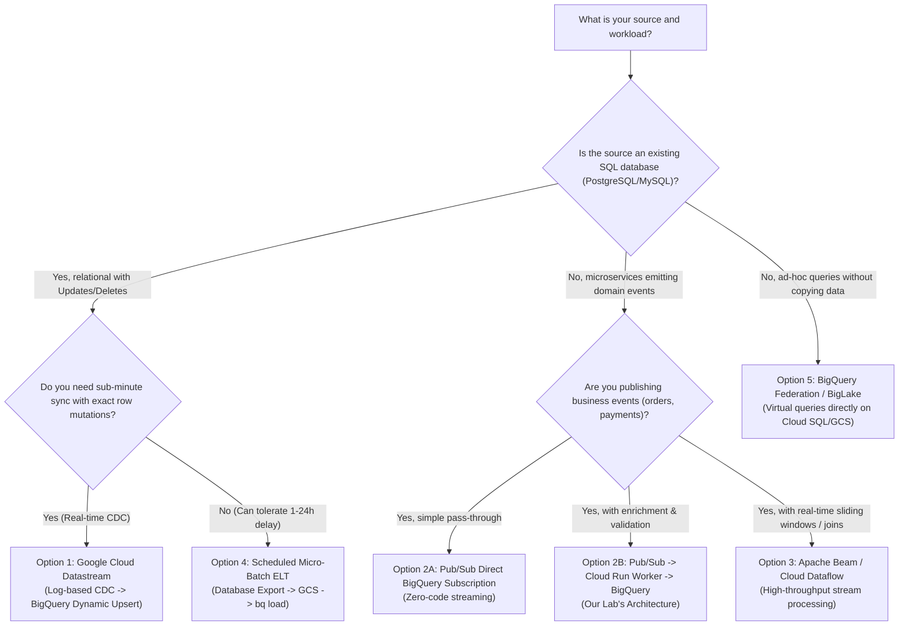
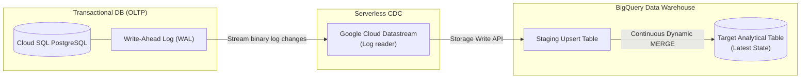
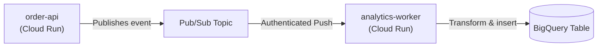
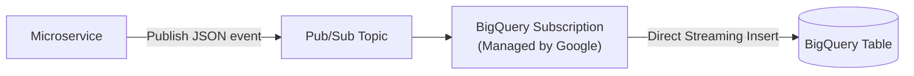
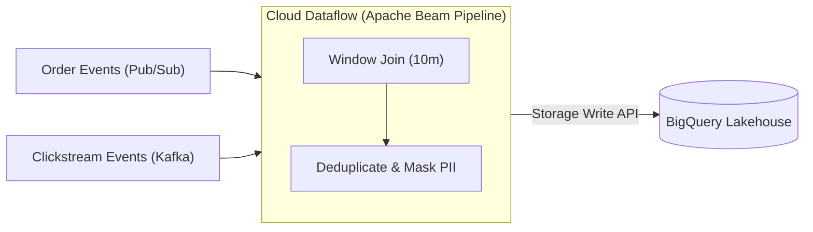
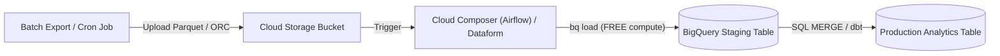

# BigQuery Data Synchronization Architectures: CDC, Event-Driven & Batch

When designing modern cloud architectures, a central question is: **How do we sync data from transactional systems (OLTP) into Google BigQuery (OLAP)?**

Because BigQuery is an append-optimized columnar data warehouse, simply running frequent `UPDATE` or `DELETE` statements will destroy query performance and spike costs. Choosing the right synchronization architecture depends on:
1. **Latency Requirements**: Real-time (seconds) vs. Near-real-time (minutes) vs. Batch (hours).
2. **Data Mutation Pattern**: Append-only events vs. mutable relational entities (updates/deletes).
3. **Application Coupling**: Database-level log scraping vs. application-level event emission.

---

## Architecture Decision Tree



---

## 1. Option 1: Change Data Capture (CDC) with Cloud Datastream

**Change Data Capture (CDC)** reads the transaction write-ahead log (WAL in PostgreSQL, binlog in MySQL, redo log in Oracle) and streams database mutations (INSERT, UPDATE, DELETE) directly into BigQuery without touching application code.



### How It Works:
1. Datastream connects to the database as a replication client reading the binary commit log.
2. Every committed change is captured with transaction metadata (`_metadata_change_type`: INSERT/UPDATE/DELETE, `_metadata_timestamp`).
3. Datastream streams records into BigQuery using the **Storage Write API**.
4. BigQuery natively handles CDC using **Dynamic Upsert / continuous MERGE** to keep the target table reflecting the exact state of the source database in near-real-time (seconds of latency).

### Pros:
- **Zero Application Changes**: Works transparently behind existing monolithic or microservice databases.
- **Full Fidelity**: Flawlessly captures deletes and updates.
- **Minimal Database Overhead**: Reading the transaction log incurs ~1-2% CPU overhead compared to polling queries (`SELECT * WHERE updated_at > ...`).

### Cons:
- **Coupled to Database Schema**: Any change to source database tables replicates directly to the warehouse.
- **Cost**: Datastream is billed per GB of data processed ($2.00/GB).

---

## 2. Option 2: Event-Driven Streaming via Pub/Sub

Rather than scraping database logs, application services emit **domain events** (`order.created`, `payment.completed`, `user.registered`) to a message broker.

### Variant A: Serverless Worker Pipeline (Our Lab's Pattern)
Used when events require validation, enrichment, or transformation before landing in BigQuery.



- **Pros**: Full code control, custom schema validation, dead-letter retries, and cross-service distributed tracing (OpenTelemetry).
- **Cons**: Requires maintaining worker container code.

---

### Variant B: Direct Pub/Sub to BigQuery Subscription (Zero-Code)
If no custom business logic or external API calls are required, Google Cloud Pub/Sub can write directly into BigQuery without any compute code.



#### How to configure:
```bash
gcloud pubsub subscriptions create order-events-bq-sub \
    --topic=order-events \
    --bigquery-table=bq-observe-lab-840614.analytics_lab.order_events \
    --use-topic-schema \
    --write-metadata
```
- **Pros**: Zero servers, zero maintenance, highly scalable, lower end-to-end latency.
- **Cons**: Ingests raw payload directly; cannot perform complex transformations or call third-party APIs during ingestion.

---

## 3. Option 3: Stream Processing ETL with Cloud Dataflow (Apache Beam)

When high-throughput event streams require complex processing—such as **sliding session windows, stateful joins across multiple streams, or complex deduplication**—Apache Beam running on **Google Cloud Dataflow** is the enterprise standard.



### Key Capabilities:
- **Exactly-Once Processing**: Guaranteed exactly-once semantics end-to-end.
- **Windowing & Watermarks**: Handles late-arriving data based on event time rather than system ingestion time.
- **Massive Throughput**: Automatically scales worker VMs to process millions of events per second.

---

## 4. Option 4: Scheduled Micro-Batch ELT (GCS + BigQuery Load Jobs)

For data that does not require sub-minute freshness (e.g. daily logs, end-of-day bank reconciliations, database snapshots), **Batch Loading** is the most cost-effective architecture in Google Cloud.



### The Best Kept Secret of BigQuery Pricing:
- **`bq load` jobs are 100% FREE for compute!**
- Google does not charge for the slots used to ingest data from Cloud Storage into BigQuery tables; you only pay for storage.
- Using compressed columnar formats like **Apache Parquet** optimizes both transfer time and schema inference.

---

## 5. Option 5: Virtual Federation & BigLake (Zero-Copy)

What if you want to query Cloud SQL or files in Cloud Storage **without copying or synchronizing them at all**?

BigQuery supports **Federated Queries** and **BigLake External Tables**:
- Connects directly to Cloud SQL (PostgreSQL/MySQL) via external connections:
  ```sql
  SELECT * FROM EXTERNAL_QUERY(
    'projects/my-proj/locations/eu/connections/sql-conn',
    'SELECT order_id, amount FROM orders WHERE status = "pending"'
  );
  ```
- **Trade-off**: Query execution runs on the source operational database. Running heavy analytical scans will slow down the production OLTP database! Best used for small lookups, dimension table joins, or ad-hoc validation.

---

## 6. How to Handle Mutations (Updates & Deletes) in BigQuery

Because BigQuery is an append-first columnar engine, you should choose one of three patterns to handle database updates:

### Pattern A: Append-Only Log + Deduplication View (Used in Event Sourcing)
Store every update as an append-only event in BigQuery. Create an authorized SQL view that extracts the latest state using the `ROW_NUMBER()` window function:

```sql
CREATE OR REPLACE VIEW `analytics_lab.v_orders_latest` AS
WITH Ranked AS (
  SELECT
    *,
    ROW_NUMBER() OVER (
      PARTITION BY order_id 
      ORDER BY processed_at DESC
    ) AS rank_order
  FROM
    `analytics_lab.order_events`
)
SELECT * EXCEPT(rank_order)
FROM Ranked
WHERE rank_order = 1;
```
- **Advantage**: Fast streaming ingestion, full audit history of all prior states.
- **Disadvantage**: View query evaluates window function on read (higher slot usage on massive tables).

---

### Pattern B: Scheduled SQL `MERGE` (dbt / Dataform / Cloud Composer)
Stream or load changes into a staging table (`order_events_staging`). Run an hourly or daily scheduled `MERGE` statement:

```sql
MERGE `analytics_lab.orders_current` T
USING `analytics_lab.order_events_staging` S
ON T.order_id = S.order_id
WHEN MATCHED AND S.status = 'cancelled' THEN
  DELETE
WHEN MATCHED THEN
  UPDATE SET T.status = S.status, T.amount = S.amount, T.updated_at = S.created_at
WHEN NOT MATCHED THEN
  INSERT (order_id, user_id, amount, status, created_at)
  VALUES (S.order_id, S.user_id, S.amount, S.status, S.created_at);
```

---

### Pattern C: Native BigQuery Change Data Capture (Dynamic Upsert)
When using Cloud Datastream, BigQuery continuously merges changes into the base table automatically in the background using the Storage Write API, eliminating manual `MERGE` batch scripts entirely.

---

## 7. Architectural Comparison Matrix

| Pattern | Ingestion Latency | Mutation Handling (Updates/Deletes) | Compute Maintenance | Ingestion Cost | Recommended Workload |
| :--- | :--- | :--- | :--- | :--- | :--- |
| **Option 1: Datastream (CDC)** | Seconds (10–30s) | Native continuous MERGE | Zero (Managed serverless) | $2.00 / GB processed | Replicating existing PostgreSQL/MySQL/Oracle databases with full schema fidelity. |
| **Option 2A: Direct Pub/Sub BQ Sub** | Sub-second (1–3s) | Append-only (Requires view deduplication) | Zero (Config only) | Pub/Sub + standard BQ streaming rates | Direct streaming of domain events with no transformation needs. |
| **Option 2B: Cloud Run Worker** | Sub-second (1–3s) | Append-only (Custom logic possible) | Low (Docker container on Cloud Run) | Cloud Run vCPU + BQ streaming | Event processing with schema validation, PII redaction, enrichment, and tracing. |
| **Option 3: Cloud Dataflow (Beam)** | Sub-second to seconds | Full stream joins, windowing, deduplication | Medium (Dataflow worker pools) | Dataflow vCPU/RAM + BQ streaming | High-throughput streaming analytics, multi-stream joins, sliding time windows. |
| **Option 4: Batch ELT (`bq load`)** | Minutes to Hours | Replaces or appends via batch load | Low (Airflow or Cloud Composer job) | **$0 compute for `bq load`** | High-volume logs, financial audits, daily historical snapshots. |
| **Option 5: Federation (BigLake)** | Real-time | Live query directly on source DB | Zero | BQ query scan + Source DB CPU | Ad-hoc queries, cross-database exploration without ingestion pipelines. |

---

## 8. Technical Interview Summary: What to Say

> **Interview Question:** *"How would you synchronize transactional data from PostgreSQL to BigQuery for real-time analytics?"*  
> **Strong Answer:**  
> *"If our goal is zero application changes and exact replica state, the industry standard on GCP is **Change Data Capture (CDC) via Cloud Datastream**. Datastream streams WAL mutations directly into BigQuery using the Storage Write API with native dynamic upserts.  
>  
> However, if the engineering organization is built on microservices emitting domain events, an **Event-Driven Architecture using Cloud Pub/Sub** is superior. Events are buffered in Pub/Sub and consumed by a serverless worker or direct BigQuery subscription. In the data warehouse, we handle updates using an append-only log model with a `ROW_NUMBER()` deduplication view, or run scheduled SQL `MERGE` statements using Dataform/dbt to balance read latency against compute costs."*
