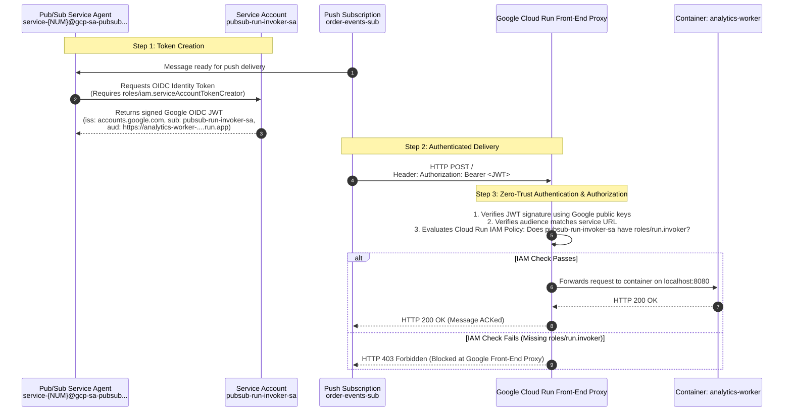

# IAM Security Model & Service-to-Service Authentication

## 1. IAM Permissions Matrix

This lab follows the Principle of Least Privilege (PoLP). No service uses default compute service accounts or owner/editor privileges. Every service runs with a dedicated identity that has only the permissions required for its specific job.

| Principal | Role | Resource | Why |
| :--- | :--- | :--- | :--- |
| `order-api-sa@...` | `roles/pubsub.publisher` | Project / Topic `order-events` | Allows `order-api` to publish domain events to the Pub/Sub topic. |
| `order-api-sa@...` | `roles/cloudtrace.agent` | Project `bq-observe-lab-840614` | Grants permission to stream OpenTelemetry trace spans to Google Cloud Trace. |
| `analytics-worker-sa@...` | `roles/bigquery.dataEditor` | Project / Dataset `analytics_lab` | Allows worker to append and stream records into table `order_events`. |
| `analytics-worker-sa@...` | `roles/bigquery.jobUser` | Project `bq-observe-lab-840614` | Allows worker identity to run BigQuery jobs and queries if needed. |
| `analytics-worker-sa@...` | `roles/cloudtrace.agent` | Project `bq-observe-lab-840614` | Grants permission to stream worker and BigQuery spans to Google Cloud Trace. |
| `pubsub-run-invoker-sa@...` | `roles/run.invoker` | Cloud Run `analytics-worker` | Authorizes Pub/Sub push subscription to invoke the private worker endpoint. |
| `service-769996365752@gcp-sa-pubsub.iam.gserviceaccount.com` (Pub/Sub Service Agent) | `roles/iam.serviceAccountTokenCreator` | Service Account `pubsub-run-invoker-sa` | Enables Pub/Sub internal service agent to mint signed OpenID Connect (OIDC) identity tokens on behalf of `pubsub-run-invoker-sa`. |
| `769996365752@cloudbuild.gserviceaccount.com` | `roles/artifactregistry.writer` | Project `bq-observe-lab-840614` | Allows Cloud Build builders to push compiled Docker container images into Artifact Registry. |

---

## 2. Core IAM Concepts Demystified

### Principal vs Role vs Resource
- **Principal (Who)**: A human identity (`user:...`), a Google-managed system service agent (`serviceAccount:service-...`), or an application identity (`serviceAccount:...`).
- **Role (What)**: A collection of granular permissions (e.g. `roles/pubsub.publisher` contains `pubsub.topics.publish`). Roles can be Predefined (GCP-managed) or Custom.
- **Resource (Where)**: The specific GCP entity the role applies to (Organization -> Folder -> Project -> Resource, e.g. a specific Cloud Run service or BigQuery dataset).

### Service Account vs IAM Role
- A **Service Account** is an **identity** (an email with public/private cryptographic keys managed by Google). It has no password and cannot log into the web console interactively.
- An **IAM Role** is a **permission bundle**.
- Giving a service account a role binds an identity to permissions.

---

## 3. How OIDC Service-to-Service Authentication Works

In this lab, `analytics-worker` is strictly private (`--no-allow-unauthenticated`). Any unauthenticated request from the internet receives `HTTP 403 Forbidden`.

How does Pub/Sub securely deliver messages to this private service?

### Why This Architecture is Production-Grade
1. **Zero Credential Secrets**:
   - No API keys, passwords, or downloaded service account JSON key files are stored in code, environment variables, or repositories.
   - All credentials use short-lived, cryptographically signed OIDC tokens minted automatically by Google Cloud.
2. **Perimeter Defense**:
   - Unauthorized traffic never reaches the container runtime. The Google Cloud Front-End proxy inspects and drops unauthenticated requests before your container spends a single CPU cycle or memory allocation.
3. **Auditability**:
   - Every invocation is logged in Cloud Audit Logs with the exact principal identity (`pubsub-run-invoker-sa`).
