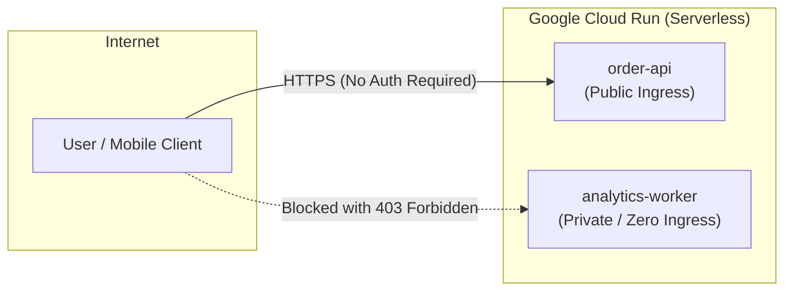

# Lesson 1: Serverless Containers & Artifact Registry

---

## 1. Architectural Concept

In cloud-native design, we decouple **ingress endpoints** from **backend processing**:



### Why Cloud Run?
1. **True Scale-to-Zero**: When no orders arrive, 0 container instances run ($0 compute cost). When traffic surges, Cloud Run spins up multiple container instances in seconds.
2. **Container Portability**: Packaged using standard Open Container Initiative (OCI) Dockerfiles. If you migrate away from GCP, the exact same container runs on AWS ECS, Kubernetes, or local Docker.
3. **No Infrastructure Maintenance**: Unlike Google Kubernetes Engine (GKE) or Compute Engine (GCE), there are no node pools, VM operating systems, security patches, or cluster control planes to manage.

### Public vs. Private Ingress
- **`order-api`**: Configured with `--allow-unauthenticated`. The Google Front-End (GFE) proxy routes all inbound HTTPS traffic to the container.
- **`analytics-worker`**: Configured with `--no-allow-unauthenticated`. The GFE proxy intercepts every inbound request and inspects the `Authorization` header. If missing or invalid, it returns `HTTP 403 Forbidden` *before* the request reaches the container.

---

## 2. Codebase Tour

### Dockerfile Design
Inspect [`services/order-api/Dockerfile`](../services/order-api/Dockerfile):

```dockerfile
FROM node:20-slim
WORKDIR /app
COPY package*.json tsconfig.json ./
RUN npm install
COPY src ./src
RUN npm run build
ENV PORT=8080
EXPOSE 8080
CMD ["node", "dist/index.js"]
```

#### Key Engineering Decisions:
- **`node:20-slim`**: Uses a lightweight Debian-based base image (~100 MB) instead of the full ~1 GB Node image, speeding up deployment and cold starts.
- **`ENV PORT=8080`**: Cloud Run automatically injects a `PORT` environment variable (default 8080). Containers must listen on `0.0.0.0:$PORT`.
- **Pre-compilation**: The TypeScript code is compiled to standard JavaScript (`dist/index.js`) during the build phase so runtime execution is lean and fast.

---

## 3. What to Check in Google Cloud Console

1. **Artifact Registry**:
   - Open [Artifact Registry Repositories](https://console.cloud.google.com/artifacts/docker/bq-observe-lab-840614/europe-west1/gcp-lab-images).
   - Click `gcp-lab-images`.
   - **Notice**:
     - Image `order-api` (tag `v1`, ~104 MB).
     - Image `analytics-worker` (tag `v1`, ~100 MB).
     - Each image has a unique SHA-256 digest providing immutability.
2. **Cloud Run Services**:
   - Open [Cloud Run Console](https://console.cloud.google.com/run?project=bq-observe-lab-840614).
   - Notice the two services listed:
     - `order-api`: Green check mark under **Security** indicating *"Allow unauthenticated invocations"*.
     - `analytics-worker`: Shield icon under **Security** indicating *"Require authentication"*.
   - Click `order-api` -> **Metrics tab**:
     - Observe live platform metrics: Request Count, Request Latencies, and Active Container Instance Count.

---

## 4. CLI Verification Commands

Run these commands in your terminal to inspect the deployed services:

```powershell
# List container images in Artifact Registry
gcloud artifacts docker images list europe-west1-docker.pkg.dev/bq-observe-lab-840614/gcp-lab-images

# Inspect order-api deployment details
gcloud run services describe order-api --region=europe-west1

# Test that order-api health endpoint is publicly accessible
curl -s https://order-api-769996365752.europe-west1.run.app/health

# Test that analytics-worker BLOCKS unauthenticated requests
curl -I https://analytics-worker-769996365752.europe-west1.run.app/health
```
*(Notice the worker returns `HTTP/2 403 Forbidden`).*

---

## 5. Interview Preparation

> **Interview Question:** *"When should you choose Cloud Run over Google Kubernetes Engine (GKE)?"*  
> **Strong Answer:**  
> *"Choose Cloud Run for stateless HTTP services, event-driven webhooks, and asynchronous workers where traffic is bursty and you want automatic scale-to-zero without cluster management overhead. Choose GKE when you need fine-grained networking (service meshes), stateful workloads, custom GPU/TPU machine configurations, non-HTTP protocols, or multi-tenant cluster isolation."*

> **Interview Question:** *"How does Cloud Run handle cold starts?"*  
> **Strong Answer:**  
> *"When a service scales from zero, the first incoming request must wait for Google to provision a container instance and start the server process. We mitigate this in production by minimizing container image size (using slim base images), keeping application initialization lightweight, and optionally setting `--min-instances=1` to keep warm instances ready."*
