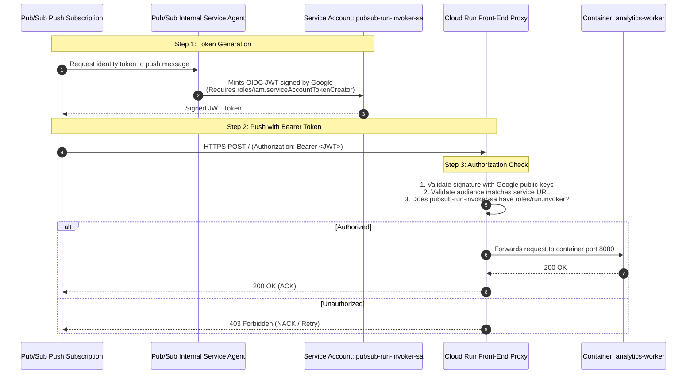

# Lesson 2: IAM & Zero-Trust OIDC Authentication

---

## 1. Architectural Concept

In enterprise cloud security, we strictly adhere to the **Principle of Least Privilege (PoLP)** and **Zero-Trust**:
- Never use personal user accounts for background workloads.
- Never use Google Compute default service accounts (`<PROJECT_NUMBER>-compute@developer...`) which often have overly broad `Editor` roles.
- Never download static service account JSON key files.



---

## 2. Core Concepts Explained

### 1. Principal vs. Role vs. Resource
- **Principal (Who)**: The identity (`serviceAccount:analytics-worker-sa@...`).
- **Role (What)**: A bundle of granular permissions (`roles/bigquery.dataEditor`).
- **Resource (Where)**: The target GCP object (`dataset:analytics_lab`).

### 2. Service Account vs. IAM Role
- A **Service Account** is an **identity** with an email address.
- An **IAM Role** is a **permission specification**.
- You attach roles to service accounts on specific resources using **IAM Policy Bindings**.

### 3. OpenID Connect (OIDC) vs. OAuth 2.0 Access Tokens
- **Access Tokens (`oauth2.googleapis.com`)**: Prove *authorization* to call Google APIs (e.g. `gcloud pubsub topics list`).
- **Identity Tokens (OIDC JWT)**: Prove *identity* to your own application or serverless endpoint (e.g. *"I am `pubsub-run-invoker-sa` and I am authorized to call `analytics-worker`"*).

---

## 3. Code & Config to Inspect

Examine the permissions granted in [`scripts/setup-gcp.sh`](../scripts/setup-gcp.sh#L39-L56):

```bash
# Order API: only publish to Pub/Sub and export traces
gcloud projects add-iam-policy-binding "$PROJECT_ID" --member="serviceAccount:${ORDER_SA}" --role="roles/pubsub.publisher"
gcloud projects add-iam-policy-binding "$PROJECT_ID" --member="serviceAccount:${ORDER_SA}" --role="roles/cloudtrace.agent"

# Analytics Worker: only write to BigQuery and export traces
gcloud projects add-iam-policy-binding "$PROJECT_ID" --member="serviceAccount:${WORKER_SA}" --role="roles/bigquery.dataEditor"
gcloud projects add-iam-policy-binding "$PROJECT_ID" --member="serviceAccount:${WORKER_SA}" --role="roles/cloudtrace.agent"

# Pub/Sub Service Agent: permission to mint tokens for the invoker identity
gcloud iam service-accounts add-iam-policy-binding "$INVOKER_SA" \
  --member="serviceAccount:${PUBSUB_AGENT}" \
  --role="roles/iam.serviceAccountTokenCreator"
```

Notice:
- `order-api-sa` has **no BigQuery permissions**. If an attacker compromises `order-api`, they cannot read or write to BigQuery.
- `analytics-worker-sa` has **no Pub/Sub publisher permissions**.

---

## 4. What to Check in Google Cloud Console

1. **IAM & Admin -> Service Accounts**:
   - Open [Service Accounts Console](https://console.cloud.google.com/iam-admin/serviceaccounts?project=bq-observe-lab-840614).
   - Verify the 3 dedicated identities:
     - `order-api-sa`
     - `analytics-worker-sa`
     - `pubsub-run-invoker-sa`
2. **Cloud Run Security Settings**:
   - Open [`analytics-worker` Permissions](https://console.cloud.google.com/run/detail/europe-west1/analytics-worker/permissions?project=bq-observe-lab-840614).
   - In the right-hand panel, notice:
     - Principal: `pubsub-run-invoker-sa@...`
     - Role: **Cloud Run Invoker** (`roles/run.invoker`).
   - Notice that `allUsers` is absent.

---

## 5. CLI Verification Commands

```powershell
# Inspect IAM policy on the private Cloud Run service
gcloud run services get-iam-policy analytics-worker --region=europe-west1

# Inspect token creator rights on pubsub-run-invoker-sa
gcloud iam service-accounts get-iam-policy pubsub-run-invoker-sa@bq-observe-lab-840614.iam.gserviceaccount.com

# Verify order-api has publisher role
gcloud projects get-iam-policy bq-observe-lab-840614 --flatten="bindings[].members" --format="table(bindings.role)" --filter="bindings.members:order-api-sa"
```

---

## 6. Interview Preparation

> **Interview Question:** *"Why should you never commit service account JSON keys to GitHub or embed them in Docker images?"*  
> **Strong Answer:**  
> *"Service account JSON keys are long-lived static credentials. If leaked, they grant persistent access to your cloud project until manually revoked. On GCP, workloads should instead use Application Default Credentials (ADC) via attached Cloud Run/GKE service accounts, or use Workload Identity Federation for external CI/CD pipelines."*

> **Interview Question:** *"How does Pub/Sub authenticate to a private Cloud Run endpoint?"*  
> **Strong Answer:**  
> *"When creating a push subscription, we specify `--push-auth-service-account`. Google's internal Pub/Sub service agent generates a signed OpenID Connect (OIDC) identity token on behalf of that service account and injects it as a Bearer token in the HTTP Authorization header. The Cloud Run front-end proxy validates the token signature, audience, and `roles/run.invoker` IAM permission before forwarding the request to the container."*
