# Lesson 3: Asynchronous Pub/Sub Decoupling & Fault Handling

---

## 1. Architectural Concept

In high-throughput microservices, coupling a client-facing API directly to analytical storage is an anti-pattern:

```mermaid
flowchart TD
    subgraph SyncPattern["Synchronous Anti-Pattern"]
        Client1["Client"] -->|"1. POST /orders"| API1["API Service"]
        API1 -->|"2. Synchronous Write"| DB1[("Analytical Data Warehouse")]
        DB1 -.->|"3. Latency spike or timeout blocks API"| API1
        API1 -.->|"4. Client checkout times out (504 Gateway Timeout)"| Client1
    end

    subgraph DecoupledPattern["Decoupled Event-Driven Pattern (This Lab)"]
        Client2["Client"] -->|"1. POST /orders"| API2["order-api"]
        API2 -->|"2. Publish event (~40ms)"| Topic["Pub/Sub: order-events"]
        API2 -->|"3. Immediate 202 Accepted"| Client2
        Topic -->|"4. Push message"| Sub["order-events-sub"]
        Sub -->|"5. Authenticated push"| Worker["analytics-worker"]
        Worker -->|"6. Analytical streaming write"| BQ[("BigQuery: order_events")]
    end
```



### Key Advantages of Decoupling:
1. **Traffic Smoothing**: If thousands of orders arrive simultaneously during a flash sale, Pub/Sub absorbs and queues the messages without overloading downstream services.
2. **Fault Isolation**: If BigQuery experiences temporary maintenance or ingestion throttling, `order-api` continues accepting orders normally. Messages simply queue in Pub/Sub until the worker recovers.
3. **Multi-Consumer Fan-Out**: Multiple subscriptions can subscribe to the same `order-events` topic (e.g. `analytics-subscription`, `fraud-detection-subscription`, `notification-subscription`) without changing a single line of `order-api` code.

---

## 2. Pub/Sub Delivery Semantics

### ACK vs. NACK
- **ACK (`HTTP 200` or `204`)**: The subscriber confirms successful processing. Pub/Sub permanently marks the message as acknowledged and removes it from the subscription backlog.
- **NACK (`HTTP 500`, `503`, or Timeout)**: The subscriber failed to process the message. Pub/Sub immediately queues the message for redelivery using exponential backoff.

### At-Least-Once Delivery & Idempotency
- Cloud Pub/Sub guarantees **at-least-once delivery**. In rare scenarios (e.g. worker writes to database but experiences a network drop before returning `HTTP 200` to Pub/Sub), Pub/Sub redelivers the message.
- **Critical Rule**: *Consumers MUST be idempotent*. They should check if an `eventId` has already been processed or use upsert/merge logic so duplicate deliveries do not duplicate business actions.

---

## 3. Codebase Tour

### Publisher (`order-api`)
Inspect [`services/order-api/src/index.ts`](../services/order-api/src/index.ts#L104-L127):

```typescript
// Publishes message to Cloud Pub/Sub asynchronously
const messageId = await topic.publishMessage({
  data: dataBuffer,
  attributes: {
    ...carrier, // W3C distributed tracecontext
    eventType: 'order.created',
    orderId,
    userId,
  },
});

// Responds immediately to the client with HTTP 202 Accepted
res.status(202).json({
  status: 'accepted',
  orderId,
  eventId,
  pubsubMessageId: messageId,
});
```

### Push Consumer (`analytics-worker`)
Inspect [`services/analytics-worker/src/index.ts`](../services/analytics-worker/src/index.ts#L61-L76):

```typescript
// Controlled failure simulation
if (event.userId === 'fail-test' || event.testFail === true) {
  logStructured('ERROR', 'Simulating worker processing failure for controlled retry lab', {
    eventId: event.eventId,
    orderId: event.orderId,
  });
  // Returning 500 signals NACK: Pub/Sub will retry this message
  res.status(500).send('Intentional failure simulation: message will be retried by Pub/Sub');
  return;
}
```

---

## 4. What to Check in Google Cloud Console

1. **Pub/Sub Topics**:
   - Open [Pub/Sub Topics](https://console.cloud.google.com/cloudpubsub/topic/list?project=bq-observe-lab-840614).
   - Click `order-events` -> **Messages tab**:
     - Notice you can publish test messages or inspect topic metrics.
2. **Pub/Sub Subscriptions**:
   - Open [`order-events-sub`](https://console.cloud.google.com/cloudpubsub/subscription/detail/order-events-sub?project=bq-observe-lab-840614).
   - Check the **Subscription details**:
     - Delivery type: **Push**
     - Endpoint: `https://analytics-worker-769996365752.europe-west1.run.app`
     - Service Account: `pubsub-run-invoker-sa@...`
     - Ack deadline: `30 seconds`
   - Scroll down to the **Unacked messages (backlog)** chart:
     - Notice how the backlog increased during our retry test and dropped to 0 after `seek`.

---

## 5. CLI Verification Commands

```powershell
# Describe subscription details and push config
gcloud pubsub subscriptions describe order-events-sub

# Inspect subscription metrics (undelivered messages count)
gcloud monitoring time-series read "metric.type = \"pubsub.googleapis.com/subscription/num_undelivered_messages\"" --limit=3

# Purge/Seek past all unacknowledged messages (discards failing retries)
$now = (Get-Date).ToUniversalTime().ToString("yyyy-MM-ddTHH:mm:ssZ")
gcloud pubsub subscriptions seek order-events-sub --time=$now
```

---

## 6. Interview Preparation

> **Interview Question:** *"What is the difference between a Push and a Pull Pub/Sub subscription?"*  
> **Strong Answer:**  
> *"In a Pull subscription, consumer workers initiate HTTPS calls to fetch batches of messages and explicitly acknowledge them. This is best for long-running batch jobs, Kubernetes worker pods, or high-volume streaming where consumers need to control their own throughput. In a Push subscription, Pub/Sub initiates HTTPS POST requests delivering messages to a webhook or serverless endpoint like Cloud Run, which is ideal for serverless auto-scaling microservices."*

> **Interview Question:** *"What happens if a message continuously fails in a subscriber? How do you prevent endless retry loops?"*  
> **Strong Answer:**  
> *"If an unhandled exception causes the worker to return 500, Pub/Sub will retry exponentially until message expiration (default 7 days). To prevent poison pill messages from clogging the queue or exhausting resources, production systems attach a Dead-Letter Topic (DLQ) with a `max-delivery-attempts` threshold (e.g. 5). Once exceeded, Pub/Sub routes the bad message to the dead-letter topic for offline triage and acknowledges it from the main queue."*
