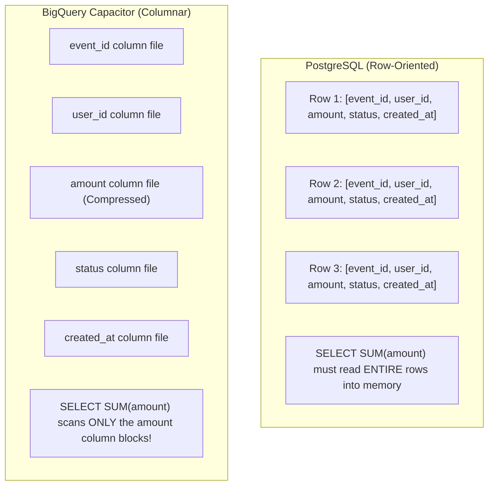

# Lesson 4: BigQuery Internals — Partitioning, Clustering & Query Jobs

---

## 1. Architectural Concept

BigQuery is Google Cloud's serverless, highly scalable enterprise data warehouse. To ace data engineering and cloud architect interviews, you must understand how BigQuery's storage architecture differs from traditional relational databases like PostgreSQL.



---

## 2. Partitioning vs. Clustering

| Mechanism | Partitioning | Clustering |
| :--- | :--- | :--- |
| **How It Works** | Physically divides the table into discrete daily, monthly, or integer partition segments. | Organizes and sorts rows *within* partitions based on up to 4 columns. |
| **Pruning Phase** | **Query Planning Time** (Before execution). | **Runtime Execution** (As blocks are scanned). |
| **Cost Estimation** | Pre-calculated accurately by `bq query --dry_run`. | Cannot be estimated prior to query execution. |
| **Lab Configuration** | Partitioned by `created_at` (`DAY` granularity). | Clustered on `user_id, status`. |

### The Real Lab Benchmark Results
In this lab, we evaluated `order_events` across 25,000 synthetic rows and 26 real orders:
- **Query without Partition Filter**: Scanned **668,750 bytes**.
- **Query with Partition Filter (`WHERE created_at >= ... 3 DAYS`)**: Scanned **115,893 bytes**.
- **Impact**: **82.7% reduction** in bytes scanned. In on-demand pricing ($6.25/TiB), partition pruning directly lowers query costs by over 80%.

---

## 3. SQL Tour & Query Patterns

Inspect the organized queries in [`sql/`](../sql/):

### 1. Partition Pruning: [`sql/partitioning.sql`](../sql/partitioning.sql)
```sql
SELECT order_id, user_id, amount, status, created_at
FROM `bq-observe-lab-840614.analytics_lab.order_events`
WHERE created_at >= TIMESTAMP_SUB(CURRENT_TIMESTAMP(), INTERVAL 3 DAY)
ORDER BY created_at DESC;
```
*BigQuery reads partition metadata and completely skips reading data files for the older 27 partitions.*

### 2. Cluster Block Pruning: [`sql/clustering.sql`](../sql/clustering.sql)
```sql
SELECT order_id, user_id, status, amount, created_at
FROM `bq-observe-lab-840614.analytics_lab.order_events`
WHERE user_id = 'user-25' AND status = 'completed';
```
*BigQuery skips storage blocks whose min/max boundaries do not contain `user-25`.*

### 3. Execution Job Metadata: [`sql/jobs.sql`](../sql/jobs.sql)
```sql
SELECT
  creation_time,
  job_id,
  query,
  total_bytes_processed,
  total_bytes_billed,
  total_slot_ms,
  cache_hit,
  TIMESTAMP_DIFF(end_time, start_time, MILLISECOND) AS runtime_ms
FROM `region-europe-west1`.INFORMATION_SCHEMA.JOBS_BY_PROJECT
WHERE project_id = 'bq-observe-lab-840614'
ORDER BY creation_time DESC LIMIT 5;
```

---

## 4. What to Check in Google Cloud Console

1. **BigQuery Table Details**:
   - Open [BigQuery Console](https://console.cloud.google.com/bigquery?project=bq-observe-lab-840614).
   - Expand `analytics_lab` -> click [`order_events`](https://console.cloud.google.com/bigquery?project=bq-observe-lab-840614&ws=!1m5!1m4!4m3!1sbq-observe-lab-840614!2sanalytics_lab!3sorder_events).
   - Click the **Details** tab:
     - Table type: `Table`
     - Data location: `europe-west1`
     - Partitioned by: `Day (field: created_at)`
     - Clustered by: `user_id, status`
     - Number of rows: `25,026`
2. **Query Plan Execution Details**:
   - Run any query in BigQuery Studio.
   - At the bottom of the screen, click **Execution Details**:
     - See execution stages: `S00: Input` -> `S01: Output`.
     - Inspect slot time consumed vs. elapsed clock time.

---

## 5. CLI Verification Commands

```powershell
# Perform a DRY RUN (Calculates bytes scanned without running the query or incurring cost)
"SELECT count(*), sum(amount) FROM ``bq-observe-lab-840614.analytics_lab.order_events`` WHERE created_at >= TIMESTAMP_SUB(CURRENT_TIMESTAMP(), INTERVAL 3 DAY)" | bq query --use_legacy_sql=false --dry_run

# Inspect table partition metadata and sizes directly
Get-Content "sql/metadata.sql" | bq query --use_legacy_sql=false --format=prettyjson
```

---

## 6. Interview Preparation

> **Interview Question:** *"Why shouldn't you use BigQuery as the primary database for an e-commerce website checkout?"*  
> **Strong Answer:**  
> *"BigQuery is designed for OLAP batch analytics and scans across columnar files, not OLTP transactional CRUD. It does not provide sub-millisecond point lookups by primary key, full ACID row-level locking, or instant unique constraint enforcement. Running high-frequency single-row queries against BigQuery incurs significant latency and exceeds on-demand query concurrency limits."*

> **Interview Question:** *"What are BigQuery Slots and how do they relate to query performance?"*  
> **Strong Answer:**  
> *"A slot is a virtual CPU and memory unit used by BigQuery's distributed execution engine. When a query is submitted, BigQuery decomposes the SQL into execution stages and assigns work to hundreds or thousands of slots in parallel. High slot milliseconds indicate CPU-heavy operations like regular expressions, complex mathematical operations, or unoptimized cross joins."*

---

## 7. Deep-Dive Reading
For a complete architectural comparison of synchronization patterns (CDC vs. Event-Driven vs. Dataflow vs. Batch Load), read:
- [**BigQuery Synchronization Architectures (CDC, Events, Beam & Batch)**](../docs/BIGQUERY-SYNC-ARCHITECTURES.md)
