# Lesson 5: Distributed Tracing with OpenTelemetry & Cloud Trace

---

## 1. Architectural Concept

In a microservices architecture, a single user click triggers a cascade of network calls across multiple containers, message brokers, and databases. When a customer complains that *"the checkout was slow,"* traditional single-server logs cannot tell you where time was lost.

**Distributed Tracing** solves this by recording an end-to-end timeline of the request:

```mermaid
gantt
    title Distributed Trace Waterfall (Trace ID: 9a0e4a10e10e1df50a3914e296b4fcfb)
    dateFormat  X
    axisFormat %s ms

    section order-api
    order-api.process-order (Root Span)       :active, 0, 39
    order-api.pubsub-publish (Child Span)     :crit, 0, 38

    section Pub/Sub & Network
    Pub/Sub Delivery Latency                  :26, 65

    section analytics-worker
    analytics-worker.process-order            :active, 65, 139
    analytics-worker.bigquery-insert (BQ)     :crit, 65, 138
```



### Trace Terminology
- **Trace ID**: A globally unique 32-character hexadecimal string identifying the entire request journey (e.g. `9a0e4a10e10e1df50a3914e296b4fcfb`).
- **Span**: A single continuous unit of work with a start time, end time, and attributes (e.g. `order-api.pubsub-publish`).
- **Span ID**: A 16-character hexadecimal string identifying an individual span.
- **Parent-Child Relationship**: Spans point to their parent span, forming a directed acyclic graph.

---

## 2. Cross-Queue Context Propagation

HTTP requests automatically propagate trace headers. But how does trace context survive an asynchronous Pub/Sub queue?

We use the **W3C Trace Context specification** (`traceparent` header):
1. **Producer (`order-api`)**: Injects the active trace context into Pub/Sub message attributes using OpenTelemetry's `propagation.inject()`.
2. **Consumer (`analytics-worker`)**: Extracts the `traceparent` from message attributes using `propagation.extract()` and sets it as the parent of its own spans.

---

## 3. Codebase Tour

### OpenTelemetry Provider Configuration
Inspect [`services/order-api/src/tracer.ts`](../services/order-api/src/tracer.ts#L10-L27):

```typescript
const provider = new NodeTracerProvider({
  resource: new Resource({
    [SEMRESATTRS_SERVICE_NAME]: serviceName,
  }),
});

// Configure Google Cloud Trace Exporter
const exporter = new TraceExporter({ projectId });
provider.addSpanProcessor(new SimpleSpanProcessor(exporter));
provider.register();

export const tracer = trace.getTracer(serviceName);
```

### Context Injection on Publish
Inspect [`services/order-api/src/index.ts`](../services/order-api/src/index.ts#L93-L109):

```typescript
// Create child span for publishing
const publishSpan = tracer.startSpan('order-api.pubsub-publish', {}, context.active());

// Inject W3C Trace Context into carrier object
const carrier: Record<string, string> = {};
propagation.inject(trace.setSpan(context.active(), publishSpan), carrier);

// Publish with carrier in message attributes
const messageId = await topic.publishMessage({
  data: dataBuffer,
  attributes: {
    ...carrier, // Contains 'traceparent': '00-<traceId>-<spanId>-01'
    eventType: 'order.created',
    orderId,
  },
});
```

### Context Extraction in Worker
Inspect [`services/analytics-worker/src/index.ts`](../services/analytics-worker/src/index.ts#L41-L47):

```typescript
// Extract W3C Trace Context from incoming message attributes
const parentContext = propagation.extract(context.active(), req.body.message.attributes || {});

// Start worker span linked to the exact same trace ID
const workerSpan = tracer.startSpan('analytics-worker.process-order', {}, parentContext);
```

---

## 4. What to Check in Google Cloud Console

1. Open [Cloud Trace Explorer](https://console.cloud.google.com/traces/explorer?project=bq-observe-lab-840614).
2. Set the time range to **Last 1 hour**.
3. In the Trace List, click on any trace for `order-api.process-order`.
4. **Inspect the Waterfall Graph**:
   - Notice the 4 spans nested in hierarchy.
   - Click on `order-api.pubsub-publish`:
     - Inspect attributes: `pubsub.message_id`, `pubsub.topic`.
   - Click on `analytics-worker.bigquery-insert`:
     - Inspect attributes: `bigquery.table`.

---

## 5. CLI Verification Commands

Query Cloud Trace API directly to see real span timestamps:

```powershell
$token = (gcloud auth print-access-token).Trim()
$traceId = "9a0e4a10e10e1df50a3914e296b4fcfb"
$url = "https://cloudtrace.googleapis.com/v1/projects/bq-observe-lab-840614/traces/${traceId}"
$res = Invoke-RestMethod -Uri $url -Headers @{ Authorization = "Bearer $token" } -Method Get
$res.spans | Select-Object -Property spanId, name, startTime, endTime | Format-Table
```

---

## 6. Interview Preparation

> **Interview Question:** *"Why use OpenTelemetry instead of proprietary cloud monitoring SDKs?"*  
> **Strong Answer:**  
> *"OpenTelemetry is an open-source, vendor-neutral CNCF standard. By instrumenting our code with OpenTelemetry APIs, we avoid vendor lock-in. If we decide to send telemetry to Google Cloud Trace today, Datadog tomorrow, or Grafana Tempo next year, we only swap the exporter configuration without rewriting our application instrumentation code."*

> **Interview Question:** *"What is trace sampling and why is it necessary in high-throughput production systems?"*  
> **Strong Answer:**  
> *"At high volumes (e.g. 100,000 requests/sec), exporting 100% of traces generates massive network overhead and unsustainable storage costs. Trace sampling records only a percentage of traces (e.g. 1% or 5%) or uses tail-based sampling to selectively capture traces that experienced high latency (p99) or returned 5xx errors."*
