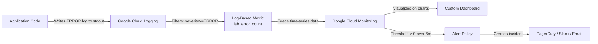

# Lesson 7: Cloud Monitoring, Log-Based Metrics & Alerting

---

## 1. Architectural Concept

Observability rests on three foundational pillars:
- **Metrics**: High-level, aggregated numeric time-series measuring system health (e.g. *"Our error rate is 2.4%"* or *"P95 latency is 350ms"*).
- **Traces**: End-to-end request journeys pinpointing *where* latency occurred.
- **Logs**: High-cardinality textual records explaining *why* an error occurred.



---

## 2. Key Metrics Concepts

### 1. Latency Percentiles (p50, p95, p99) vs. Averages
- **Average (Mean)** hides outliers. If 99 users experience 20ms and 1 user experiences 10,000ms, the average is ~120ms.
- **P95 Latency**: 95% of users experienced faster response times; only 5% were slower.
- **P99 Latency**: Captures worst-case tail latency, often caused by cold starts, garbage collection pauses, or database lock contention.

### 2. What is a Log-Based Metric?
Instead of installing proprietary metrics agents or publishing custom Prometheus counters in application code, Google Cloud Logging can extract metrics directly from log events:
- **Filter**: `resource.type="cloud_run_revision" AND severity>=ERROR`
- **Output Metric**: `logging.googleapis.com/user/lab_error_count`

---

## 3. Configuration Tour

### Cloud Monitoring Dashboard Configuration
Inspect [`monitoring/dashboard.json`](../monitoring/dashboard.json):

```json
{
  "displayName": "BigQuery Observability Lab",
  "gridLayout": {
    "columns": "2",
    "widgets": [
      {
        "title": "Order API - Request Count",
        "xyChart": { ... }
      },
      {
        "title": "Order API - Request Latency (p95)",
        "xyChart": { ... }
      },
      {
        "title": "Analytics Worker - Invocations",
        "xyChart": { ... }
      },
      {
        "title": "Application Error Count (Log-Based Metric)",
        "xyChart": { ... }
      },
      {
        "title": "Pub/Sub - Undelivered Messages Backlog",
        "xyChart": { ... }
      },
      {
        "title": "Cloud Run - Active Instance Count",
        "xyChart": { ... }
      }
    ]
  }
}
```

### Alert Policy Configuration
Inspect [`monitoring/alert-policy.json`](../monitoring/alert-policy.json):

```json
{
  "displayName": "Lab High Application Error Rate",
  "conditions": [
    {
      "displayName": "Application ERROR log count > 0",
      "conditionThreshold": {
        "filter": "resource.type = \"cloud_run_revision\" AND metric.type = \"logging.googleapis.com/user/lab_error_count\"",
        "comparison": "COMPARISON_GT",
        "thresholdValue": 0,
        "duration": "0s",
        "aggregations": [
          {
            "alignmentPeriod": "300s",
            "perSeriesAligner": "ALIGN_DELTA"
          }
        ]
      }
    }
  ],
  "combiner": "OR",
  "enabled": true
}
```

---

## 4. What to Check in Google Cloud Console

1. **Custom Dashboard**:
   - Open [Cloud Monitoring Dashboards](https://console.cloud.google.com/monitoring/dashboards?project=bq-observe-lab-840614).
   - Click **`BigQuery Observability Lab`**.
   - **Inspect the 6 Live Charts**:
     - See the request count and p95 latency spikes from our traffic generator.
     - See the log-based metric `lab_error_count` registering errors from `/test-error`.
2. **Alerting & Incidents**:
   - Open [Alerting Console](https://console.cloud.google.com/monitoring/alerting?project=bq-observe-lab-840614).
   - Click policy **`Lab High Application Error Rate`**:
     - Check the **Incidents** tab: observe the incident created when our test error fired!

---

## 5. CLI Verification Commands

```powershell
# Inspect the log-based metric descriptor
gcloud logging metrics describe lab_error_count

# Read time-series values for the error metric
gcloud monitoring time-series read "metric.type = \"logging.googleapis.com/user/lab_error_count\"" --limit=3

# Trigger a test error to increment the metric and fire the alert policy
curl -s https://order-api-769996365752.europe-west1.run.app/test-error
```

---

## 6. Interview Preparation

> **Interview Question:** *"How would you design an alert strategy for a mission-critical checkout microservice?"*  
> **Strong Answer:**  
> *"We follow Google's SRE golden signals: Latency, Traffic, Errors, and Saturation. We configure alerts on Symptoms (customer impact) rather than internal causes:  
> 1. High 5xx Error Rate (> 1% over 5 minutes).  
> 2. P95/P99 Latency Breach (> 1.5 seconds over 5 minutes).  
> 3. Pub/Sub Unacknowledged Message Backlog Age (> 60 seconds).  
> This ensures on-call engineers are paged only when user experience or system throughput is actively degraded, avoiding alert fatigue."*

> **Interview Question:** *"What is the difference between a log-based metric and standard platform metrics?"*  
> **Strong Answer:**  
> *"Platform metrics are pre-defined by Google Cloud services (e.g. CPU utilization, network egress, raw HTTP request count). A log-based metric is a custom metric derived from logs ingested by Cloud Logging. It allows us to track domain-specific business events or specific application exception types without adding custom metrics instrumentation libraries to application code."*
